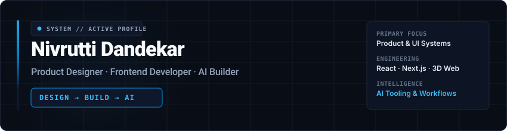
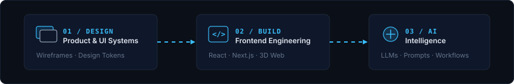

<p align="center">
  <a href="https://nivruttidandekar.vercel.app/">
    
  </a>
</p>

---

### 01 // ABOUT

<p align="center">
   Build -> AI Workflow Architecture" width="100%" />
</p>

> **PRODUCT DESIGNER · FRONTEND DEVELOPER · AI BUILDER**
> 
> I design digital products, build modern web interfaces, and explore how AI can improve the way products are designed and built.
> 
> Focused on bridging the gap between product design, interactive frontend engineering, and AI-assisted workflows.

---

### 02 // SELECTED WORK

<table width="100%">
  <tr>
    <td width="50%" valign="top">
      <h4><a href="https://github.com/Nivaa23/addcode-internal-dashboard">ADDCODE Internal Dashboard</a></h4>
      <p><b>Domain:</b> Enterprise Internal Application</p>
      <p>Operational internal management interface built for structured workflows, real-time data handling, and backend state integration.</p>      <p>
        
        
        
        
      </p>
      <p>↳ <a href="https://github.com/Nivaa23/addcode-internal-dashboard">View Repository</a></p>
    </td>
    <td width="50%" valign="top">
      <h4><a href="https://github.com/Nivaa23/geo-designs-dashboard">Geo Designs Dashboard</a></h4>
      <p><b>Domain:</b> Analytics &amp; Data Visualization</p>
      <p>Precision analytics dashboard focused on clear visual telemetry, modular component layout, and typed frontend architecture.</p>
      <p>
        
        
        
      </p>
      <p>↳ <a href="https://github.com/Nivaa23/geo-designs-dashboard">View Repository</a></p>
    </td>
  </tr>
  <tr>
    <td width="50%" valign="top">
      <h4><a href="https://github.com/Nivaa23/cranial-space-modern">Cranial Space Modern</a></h4>
      <p><b>Domain:</b> 3D Web Experience &amp; Interactive Graphics</p>
      <p>Interactive web application exploring 3D visual canvas rendering, spatial layout, and high-performance motion design.</p>
      <p>
        
        
        
      </p>
      <p>↳ <a href="https://github.com/Nivaa23/cranial-space-modern">View Repository</a></p>
    </td>
    <td width="50%" valign="top">
      <h4><a href="https://github.com/Nivaa23/Addcode-Engineering">ADDCODE Engineering</a></h4>
      <p><b>Domain:</b> Industrial Corporate Platform</p>
      <p>Corporate web portal for an industrial design firm, featuring Bento grid layout architecture, micro-interactions, and canvas animation effects.</p>
      <p>
        
        
        
      </p>
      <p>↳ <a href="https://github.com/Nivaa23/Addcode-Engineering">View Repository</a> | <a href="https://addcodeengineering.com/">Live Platform</a></p>
    </td>
  </tr>
</table>

---

### 03 // PRODUCT DESIGN

<table width="100%">
  <tr>
    <td width="30%"><b>Product &amp; UX/UI Design</b></td>
    <td>Concept structuring, user flows, wireframing, and interface design</td>
  </tr>
  <tr>
    <td width="30%"><b>Design Systems &amp; Tokens</b></td>
    <td>Modular component libraries, layout tokens, and scalable visual standards</td>
  </tr>
  <tr>
    <td width="30%"><b>Interactive Motion</b></td>
    <td>Fluid micro-interactions and scroll physics with GSAP and Framer Motion</td>
  </tr>
  <tr>
    <td width="30%"><b>Bento &amp; Spatial Layouts</b></td>
    <td>Asymmetrical grid interfaces for technical product presentation</td>
  </tr>
  <tr>
    <td width="30%"><b>Canvas &amp; 3D Interfaces</b></td>
    <td>Integrating WebGL canvas graphics and Three.js environments into web apps</td>
  </tr>
</table>

---

### 04 // ENGINEERING STACK

<table width="100%">
  <tr>
    <td width="25%"><b>01 / FRONTEND</b></td>
    <td>
      
      
      
      
      
      
      
      
    </td>
  </tr>
  <tr>
    <td width="25%"><b>02 / DESIGN &amp; MOTION</b></td>
    <td>
      
      
      
      
      
      
    </td>
  </tr>
  <tr>
    <td width="25%"><b>03 / BACKEND &amp; DATA</b></td>
    <td>
      
      
      
    </td>
  </tr>
  <tr>
    <td width="25%"><b>04 / DEVELOPMENT &amp; DEPLOYMENT</b></td>
    <td>
      
      
      
    </td>
  </tr>
  <tr>
    <td width="25%"><b>05 / AI &amp; EXPERIMENTATION</b></td>
    <td>
      
      
      
      
    </td>
  </tr>
</table>

---

### 05 // AI & EXPERIMENTS

> *"I use AI as part of the product-building process — from exploration and UX iteration to coding, prototyping, and experimentation with LLM-powered interfaces."*

<table width="100%">
  <tr>
    <td width="30%"><b>AI-ASSISTED DEVELOPMENT</b></td>
    <td>
      
      
      
      <p>Architecture planning, prompt-driven UI design, and code optimization.</p>
    </td>
  </tr>
  <tr>
    <td width="30%"><b>LOCAL AI</b></td>
    <td>
      
      <p>Running and testing local LLM models for developer workflow acceleration.</p>
    </td>
  </tr>
  <tr>
    <td width="30%"><b>PRODUCT AI</b></td>
    <td>AI-powered interfaces · AI workflows · AI-assisted prototyping</td>
  </tr>
</table>

---

### 06 // CAPABILITIES MATRIX

<table width="100%">
  <tr>
    <th width="33%">DESIGN</th>
    <th width="33%">BUILD</th>
    <th width="34%">INTELLIGENCE</th>
  </tr>
  <tr>
    <td valign="top">
      <p><b>Product Design</b></p>
      <p>UX/UI &amp; Wireframing</p>
      <p>Design Systems</p>
      <p>Interactive Prototyping</p>
    </td>
    <td valign="top">
      <p><b>Frontend Engineering</b></p>
      <p>React &amp; Next.js</p>
      <p>TypeScript &amp; Modern Web</p>
      <p>3D Canvas &amp; WebGL Motion</p>
    </td>
    <td valign="top">
      <p><b>AI-Assisted Development</b></p>
      <p>LLM Workflows &amp; Prompting</p>
      <p>AI Tooling (ChatGPT, Claude, Gemini)</p>
      <p>Local Model Experimentation (Ollama)</p>
    </td>
  </tr>
</table>

---

### 07 // PRINCIPLES

```
Design with intent.
Build with clarity.
Use technology where it creates meaningful leverage.
```

---

### 08 // CONTACT & LINKS

- 🌐 **Portfolio**: [nivruttidandekar.vercel.app](https://nivruttidandekar.vercel.app/)
- 💼 **LinkedIn**: [Nivrutti Dandekar](https://www.linkedin.com/in/nivrutti-dandekar-71638768/)
- 🏢 **ADDCode Engineering**: [addcodeengineering.com](https://addcodeengineering.com/)
- 💻 **GitHub**: [github.com/Nivaa23](https://github.com/Nivaa23)
